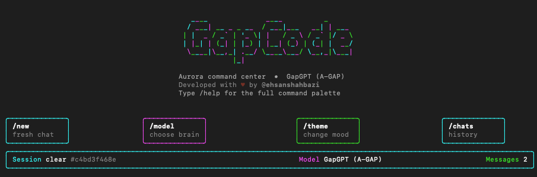
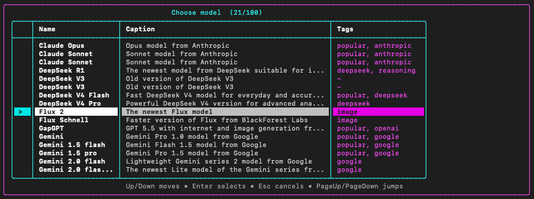
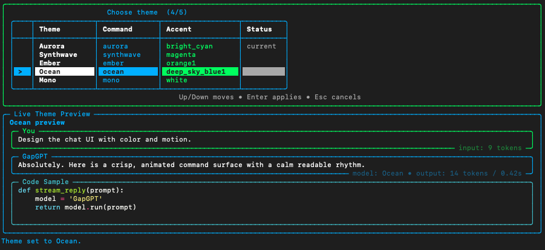
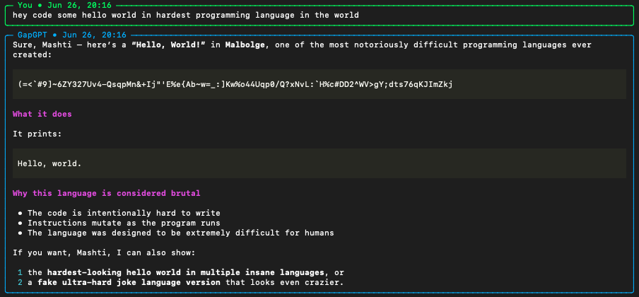

# GapGPT CLI


A polished terminal chat client for GapGPT with animated startup, keyboard-driven model/theme pickers, local chat sessions, and streamed WebSocket responses.

Developed with heart by [@ehsanshahbazi](https://github.com/EhsanShahbazii).

## Preview

<p align="center">
  
</p>

<p align="center">
  
  
</p>

<p align="center">
  
</p>

## Features

- Animated Rich-powered terminal UI
- GapGPT WebSocket streaming with `text_response_chunk` support
- Local chat history in `~/.gapcode/chats.json`
- New, open, rename, delete, export, and list chats
- Model picker loaded from `models.json`
- Arrow-key theme picker with live preview
- Verbose metadata footers for model, token-like counts, and timings
- Keyboard controls: `Up/Down`, `Enter`, `Esc`, `PageUp/PageDown`, plus `j/k`

## Quick Start

```bash
git clone https://github.com/EhsanShahbazii/GapGPT-CLI.git
cd GapGPT-CLI
python3 -m venv venv
source venv/bin/activate
pip install -e .
gapgpt
```

## Install

```bash
python3 -m venv venv
source venv/bin/activate
pip install -r requirements.txt
```

For editable local development:

```bash
pip install -e .
```

## Run

```bash
python gapcode.py
```

Or, after editable install:

```bash
gapgpt
```

You can also run the package directly:

```bash
python -m gapgpt_cli
```

## Authentication

On first run, the CLI asks for your GapGPT access token and stores it locally at:

```text
~/.gapcode/token
```

The token is sensitive. Do not commit it, paste it into issues, or share it publicly.

## Commands

| Command | Description |
| --- | --- |
| `/help` | Show the command palette |
| `/new [title]` | Start a new chat |
| `/chats` | List local saved chats |
| `/open <number\|id>` | Switch to a saved chat |
| `/delete [number\|id\|current]` | Delete a local chat |
| `/rename <title>` | Rename the current chat |
| `/history [count]` | Show recent messages |
| `/models [search]` | Browse available models |
| `/model [search\|value]` | Open the arrow-key model picker |
| `/theme [name]` | Open the live theme picker |
| `/verbose [on\|off]` | Toggle model/tokens/timing footers |
| `/settings` | Show current settings |
| `/export [path]` | Export the current chat as Markdown |
| `/token` | Re-authenticate |
| `/banner` | Replay the animated banner |
| `/clear` | Clear the terminal |
| `/exit` | Quit |

## Project Structure

```text
gapgpt_cli/
  app.py       # Rich terminal UI, commands, chat/session handling
  auth.py      # token/config loading and login helper
  client.py    # GapGPT WebSocket protocol and streaming parser
  models.json  # model catalog used by the picker
  __main__.py  # python -m gapgpt_cli entry point
gapcode.py     # backwards-compatible launcher
```

## Development

Run syntax checks:

```bash
python -m py_compile gapcode.py auth.py ws.py gapgpt_cli/*.py
```

The project intentionally stores runtime credentials and chat history outside the repo under `~/.gapcode`.

## License

MIT License. See [LICENSE](LICENSE).
